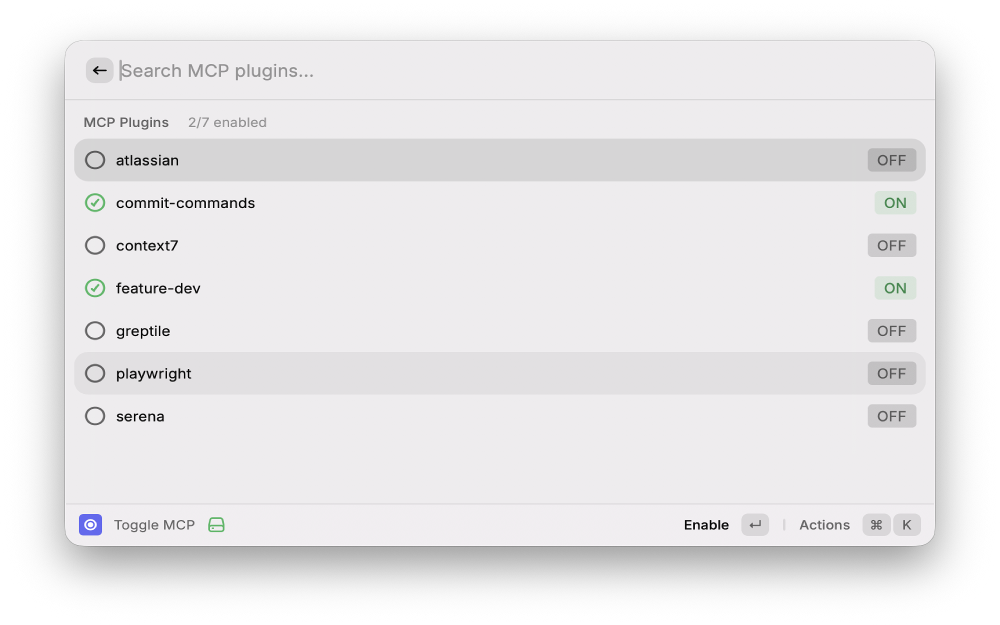
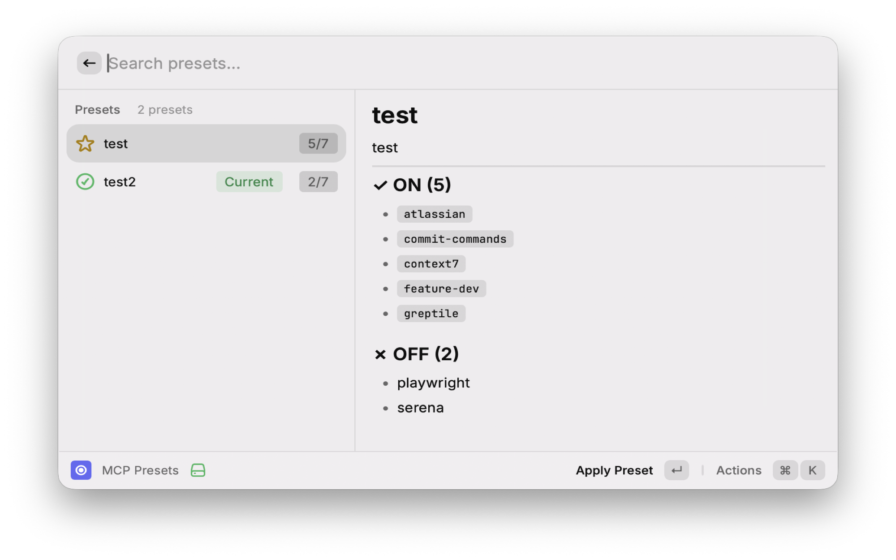
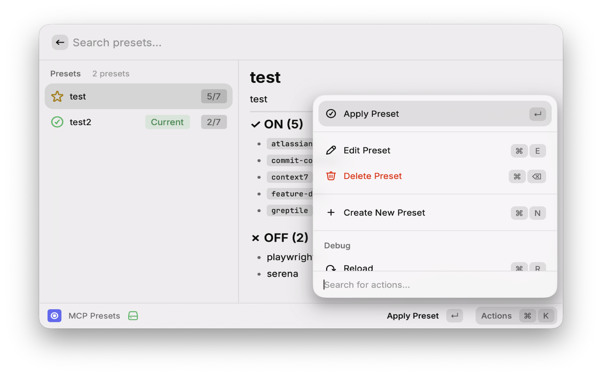
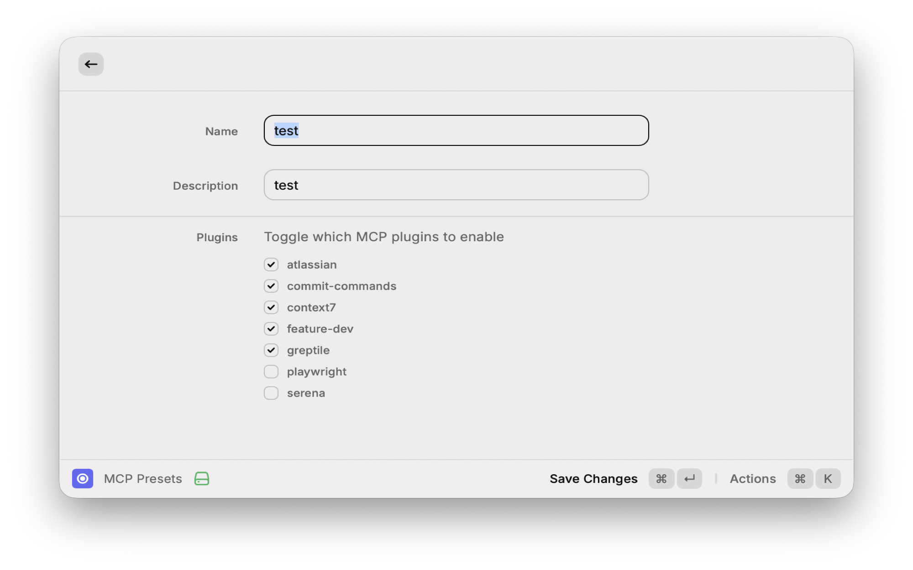

# Claude Code MCP Manager

A Raycast extension to manage Claude Code MCP (Model Context Protocol) plugins.

## Features

- **Toggle MCP**: Enable/disable individual MCP plugins
- **MCP Presets**: Create, edit, delete, and apply custom presets
- **Current State Indicator**: See which preset matches your current configuration

## Screenshots









## Commands

| Command | Description |
|---------|-------------|
| Toggle MCP | Toggle individual MCP plugins on/off |
| MCP Presets | Manage and apply MCP presets |

### Preset Actions

| Action | Shortcut |
|--------|----------|
| Apply Preset | `Enter` |
| Create Preset | `⌘ + N` |
| Edit Preset | `⌘ + E` |
| Delete Preset | `⌘ + ⌫` |

## File Locations

- Claude settings: `~/.claude/settings.json`
- Custom presets: `~/.claude/mcp-presets.json`

## Installation

### From Source

```bash
git clone https://github.com/doxxx-playground/claude-code-mcp-manager.git
cd claude-code-mcp-manager
npm install
npm run dev
```

## Why?

MCP plugins consume context tokens on every conversation. Managing which plugins are active helps:

- Reduce token usage
- Improve response latency
- Focus on relevant tools for the task

## License

MIT
